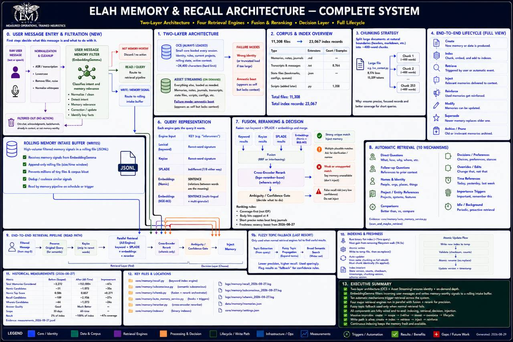

# MOTH: agent-memory-template

A file-based memory system for an AI agent: a format, a set of small tools — some for **reading**
memory, some for **writing** it well, some for **checking the repo itself** — and, more importantly,
the findings that make the difference between a memory folder an agent *has* and one it actually
*uses*.

> ⚠ This line used to say "three small tools" while eight shipped. A count typed into prose is a
> claim nothing verifies, and it goes stale the first time the thing it describes grows. The same
> defect was found the same week in `lint_prompts.py`, whose footer advertised six rules while seven
> ran — there it was fixed by *computing* the number. Prose cannot compute, so prose should not
> count. Roles do not drift; totals do.

**The write side is the half most memory projects skip.** Retrieval gets the attention because it is
the part you can benchmark. But a note that shares no content word with the question you will later
ask is not a ranking problem — it is unreachable, and no engine recovers it. That is decided at write
time, for free, by whoever names the file. `findable.py` and `memory_echo.py` exist to make that
decision checkable instead of a habit you are trusted to keep.

Plain Python 3, no dependencies, no index to build, no service to run.

```
memory/                your memories, one fact per .md file
sample/memory/         10 same-genre notes + probes with KNOWN answers, so the benchmark can fail
sample/mixed/          11 DIFFERENT kinds of note — what a real folder looks like
tools/recall.py        search memory
tools/whereis.py       search memory FIRST, then the filesystem
tools/memory_echo.py   show the closest existing memories before you write a new one
tools/findable.py      will you FIND this record later, and will it WIN? ask BEFORE writing
tools/wired.py         is component X actually called by module Y? (AST, not grep)
tools/benchmark.py     measure retrieval — and --verify, the acceptance check YOU run
tools/coverage.py      does every architecture box have a home? fails if one does not
tools/lint_prompts.py  catches build instructions that CANNOT BE FOLLOWED
tools/downstream_of.py what did you already build on a number that turned out wrong?
tools/memory_candidates.py   the WRITE-side queue: capture, retrieval-feedback, no promotion
tools/candidate_classify.py  embedder-as-kNN filter for that queue — MEASURED WEAK, see Stage 11
docs/FORMAT.md         the file format and the rules behind it
docs/AGENT_INSTRUCTIONS.md   paste-in prompt block — how the agent USES this (permanent)
docs/BUILD_PROMPTS.md  staged prompts to build the engines NOT in this repo (discard after)
docs/AUDIT.md          what "audited" means here, including what was NOT verified
```

### The two write-side tools, and why they exist

Everything else here is about READING memory. These two are about writing it, and they close the
two gaps that cost the author the most:

**`findable.py` — ask before you write, not after.** Findability is not a property of a title. It is
a property of the PAIR: how you wrote the record, and how you would later ask for it. So it takes
both, and returns two verdicts, because they fail for different reasons:

- **FOUND?** — the question against the whole record (title + description + body). This is the cliff
  test. Measured across 24 probes on two corpora: **0 shared content words → 0/4 found; ≥1 shared
  content word → 20/20 found, all in the top three.** Failing this means rewrite the content.
- **WINS?** — the question against title and description only. Retrieval reads bodies, but body hits
  saturate while name and description carry roughly 10x and 8x the weight. So you can be *found* and
  still lose to any file with the word in its name. Failing this means rename the file.

> ⚠ The first version checked the title alone and would have **failed records that are perfectly
> findable through their body**. A gate that rejects good records is worse than no gate, because you
> learn to ignore it. Caught by someone asking a plain question about how retrieval actually works.

**`wired.py` — is this component actually called?** Parses the AST rather than grepping, because
grep OVER-reports (it matches comments praising a thing that was never wired) and naive import
analysis UNDER-reports (it misses subprocess dispatch, dispatch-by-filename, and aliased lazy
imports). It under-reports by design, so read it accordingly: **"wired" is a strong claim from it,
"not wired" is a weak one.** The author repeatedly mistook the weak claim for a finding — see
`docs/AUDIT.md`.

Every tool has `--selftest`. Run them before trusting any of it:

```bash
python tools/recall.py --selftest
python tools/whereis.py --selftest
python tools/memory_echo.py --selftest
python tools/findable.py --selftest
python tools/wired.py --selftest
python tools/benchmark.py --selftest
```

⚠ A passing selftest means the code does what the code intends. It says **nothing** about whether
retrieval works — that is what `benchmark.py` is for, and it is the only thing here that has ever
come back red.

---

## Architecture

Two paths, and **they do not meet.** That separation is the design, not an omission.

```
                       ┌──────────────────────────────────────────┐
   USER MESSAGE ──────►│  READ PATH  (synchronous, on the wire)   │
        │              └──────────────────────────────────────────┘
        │                    keyword  +  keyize
        │                          │
        │                         RRF                 ← fusion, not score averaging
        │                          │
        │                    ┌─────┴─────┐
        │                    │   GATE    │  ANSWERED · CLARIFY · ABSENT
        │                    └─────┬─────┘
        │                      WEAK│
        │                          ▼
        │                  SPLADE escalation          ← only on a weak result, never by default
        │                          │
        │                  fuzzy-topic fallback       ← only if that returns nothing usable
        │
        │              ┌──────────────────────────────────────────┐
        └─────────────►│ WRITE PATH  (asynchronous, off the wire) │
                       └──────────────────────────────────────────┘
                            captured message stream
                                   │
                         EmbeddingGemma kNN classifier
                                   │
                       CURRENT_CONTEXT ──► ignored
                       MEMORY_CANDIDATE ──► _memory_candidates.jsonl  (rolling queue)
                                   │
                                   ╫  ← THE TEMPLATE STOPS HERE, ON PURPOSE
                                   │
                        promotion to permanent memory
                        = a separate, human-visible decision
```

**Why the classifier is not on the read path.** It was, once. The extra payload competed with the
message for one event budget and truncated the user's actual question — three retrieved files
visible and not the question they belonged to. Anything bolted to that path competes with the
message, and the message must win. So classification is a separate pass over the inbox.

**Why the write path stops at a queue.** A queue can hold a mistake cheaply and reversibly; permanent
memory cannot. `tools/memory_candidates.py` carries a selftest that **fails if the module ever
imports a memory writer** — the isolation is structural, not a convention.

> ### About this poster
>
> 
>
> **It is not a picture of this template** and should not be read as one. It depicts the author's
> larger production system combined with this reference implementation, and it diverges from the
> code here in four structural ways — three of which are not simplifications but the *opposite* of
> what this repository measured and concluded:
>
> | the poster shows | this repository |
> |---|---|
> | EmbeddingGemma gating the synchronous message path | deliberately **off** that path (see above) |
> | SPLADE as one of four parallel fusion engines | **escalation only** — as a fusion member it lost a query the baseline had already answered |
> | a cross-encoder as an active production stage | **rejected on measurement**: SPLADE 10/14 → SPLADE + `bge-reranker-base` 6/14 |
> | an automatic write into permanent memory | stops at the candidate queue; promotion is a separate human decision |
>
> ⚠ An earlier revision of this README placed that image under this heading and captioned it
> *"deliberately simplified — the shape, not the implementation."* That was wrong, and the way it was
> wrong is worth keeping: a *simplification* omits detail, while three of the four rows above are
> configurations this repository **tested and refused**. The caption also made the mismatch
> unfalsifiable in advance — if the picture and the code disagree the code wins, so no disagreement
> could ever count as a defect. Nobody had compared them. A hedge that sounds careful is not a check.

## How retrieval actually works

Four engines, a fusion step, and a decision layer. Each engine fails differently, which is the only
reason there is more than one.

**The read path, end to end:**

```
query -> [query representation, per engine] -> engines run in parallel
                                                 |
      keyword ---- coverage-first, body-capped ---+
      keyize ----- query reduced to its rare terms|
      SPLADE ----- sparse expansion (optional)    +--> fusion (RRF) -> rerank -> decision
      embeddings - dense semantic (optional)      |                              |
                                                 -+                    ANSWERED / CLARIFY / ABSENT
```

**Why four.** Keyword search misses paraphrase. Embeddings miss rare exact terms — a filename, an
error code, a person's handle. A cross-encoder is accurate and far too expensive to run over a
corpus, so it only reranks what something cheaper already found. None of them is a superset of
another, so the stack is not redundancy, it is four instruments with different blind spots.

**Ranking rules that matter more than the engines.** Coverage first: a note matching three of your
query's words beats one matching a single word ten times. Body text counts for *finding* a document
but is capped for *ranking* it, so a passing mention cannot outrank a note that is actually about the
subject. Short precise notes outrank long journals.

**Fusion is RRF**, not score-averaging. Engines produce incomparable scores; they produce comparable
*ranks*. Reciprocal Rank Fusion combines positions, so no engine's scale can dominate, and a document
that several engines rank moderately well beats one that a single engine loves.

**The decision layer is the part most systems skip.** Retrieval returns three outcomes, not one:

| outcome | meaning | what the agent does |
|---|---|---|
| ANSWERED | a confident hit | use it |
| CLARIFY | plausible hits, no clear winner | ask which one |
| ABSENT | nothing matched | **say so** — do not answer from generic knowledge |

ABSENT is the whole point. A retrieval system that always returns *something* is indistinguishable
from one that is broken, because the failure looks identical to a weak success. If nothing is found,
the honest output is "I have nothing on that."

**Two-layer loading.** A small always-loaded core (identity, rules, index) plus everything else
streamed on demand. The core is read at every boot; the rest is fetched only when a query calls for
it. Keep the core small — see the size caveat below.

**Documents are chunked at natural boundaries** — headings and paragraphs, never a fixed byte count
that lands mid-sentence. Retrieval returns the chunk, not the file, so a long note stays findable by
any section of it. Chunk carelessly and you will manufacture defects that are not there: measured in
this repo's own audit, a third of the findings from local reviewers were artifacts of cutting files
to fit a context window, not faults in the code.

**How the reference system actually uses SPLADE.** The base engines run first — keyword, keyize,
fusion. The result is scored, and if the verdict comes back **WEAK** (nothing confident, no clear
winner) the query escalates to a second pass that adds SPLADE's sparse expansion. On the author's
corpus that escalation fires on roughly 64% of queries, and it exists for exactly one job: catching
what the lexical engines miss because the note never used the words you searched with.

It is deliberately *not* in the default path. The cost is a slower second pass; the benefit is that
the fast path stays fast and the expensive engine only runs where the cheap ones already failed.

**Where you put an engine changes its verdict.** The clearest measured result in this repo: a
sparse-expansion engine (SPLADE) found 10 of 14 probes against a 7 of 14 baseline — but *fused in as
another ranked list* it also lost one probe the baseline had answered. As an **escalation**, run only
when the base verdict returns WEAK, it cannot do that: when the baseline already answered, it never
executes. Same model, same corpus, opposite verdict, and the only variable is pipeline position.
Test placement, not just engines. (⚠ SPLADE is CC BY-NC-SA 4.0 — non-commercial — which is a separate
gate that fails independently of any benchmark. `BAAI/bge-m3` is MIT if you want a learned tier.)

**Fuzzy topic fallback** runs only after everything else has returned ABSENT. It is a last resort by
construction, not a tier in the ranking.

## Hooks: making retrieval happen without being asked

The engines are useless if nothing invokes them. The failure this repo is built around is not bad
ranking — it is a system that never queried itself. Wire these:

**1. Before answering anything factual about the user.** The trigger is a *feeling*, and that is the
problem: the moment you feel you already know is exactly the moment you stop checking. So make it
unconditional rather than discretionary — any claim about the user's history, preferences, or past
decisions runs a lookup first.

**2. Make retrieval cheaper than not retrieving.** The only corrections that stick are the ones that
reduce effort. A combined tool that searches memory *and* the filesystem in one call will get used;
two separate tools where memory is the optional extra will not.

**3. Before writing a new memory, search for the old one.** Duplicate lessons are the normal failure
of an append-only store. Rank candidate matches, but **do not gate on the score** — measured here, a
genuine duplicate and an unrelated note score close enough that a threshold is a coin toss with
authority. Surface the top matches and let the agent read them.

**4. On retrieval, mark what was used.** A candidate that gets retrieved has earned its place; one
that never does has not. That is a promotion signal you get for free, and it beats any confidence
score you could invent.

**5. Never let the hook compete with the message.** If retrieval output shares a budget with the
user's actual question, the question loses. Run it as a separate pass, or keep the injected payload
to one compact line.

## The one idea worth stealing

**Storage is not the hard part. Retrieval is.**

An agent with a thousand excellent memories and no cheap way to reach them behaves *exactly* like an
agent with none — and the failure is silent. Nothing errors. It simply answers from context and never
discovers the answer was already on disk.

The instinct is to write a rule: *"always check memory first."* That does not work, because the rule
competes with the urge to just go and look, and the urge wins at precisely the moment it matters.

So do not add a rule. **Change the cost.**

`whereis.py` is the whole argument in one file: it wraps the filesystem search the agent already
wants, and puts the memory search in front of it. Checking memory stops being something to remember
and becomes something that happens on the way to what you were doing anyway.

> The rule version — "check memory first" — is obeyed when convenient.
> The cost version — memory search is free and already on the path — is obeyed always.

---

## Benchmarking: read this before you trust any number

**An agent cannot meaningfully benchmark its own memory, and its self-tests will look excellent.**

The failure looks like this. The agent picks probe questions, queries its memory, and scores itself.
But it picks the probes — so it reaches for topics it already knows the corpus does not contain.
Ask a memory about *chip manufacturing techniques* when nobody involved has ever made a chip, watch
nothing come back, and record a pass. **That test cannot fail.** It confirms that absent things are
absent, which is true of any system, including a broken one and including an empty folder.

Empty is not the same as correct. A retrieval test whose expected answer is "nothing" measures
nothing.

### What this repo measures on itself

Two corpora ship, deliberately:

* `sample/memory/` — ten engineering war stories. One genre, one register, one vocabulary.
* `sample/mixed/` — eleven *different kinds of thing*: a program, a message a user sent, a message an
  assistant sent, journals, a calendar entry, an archive entry, a joke, a recipe, a planning prompt.
  This is what a real notes folder looks like.

```bash
python tools/benchmark.py                                                    # war stories
python tools/benchmark.py --root sample/mixed --probes sample/mixed_probes.json
```

Each run reports **three sections that are never summed**, because each answers a different question:

| section | question it answers | expectation | scored? |
|---|---|---|---|
| **[1] works** | Does it work? Questions phrased the way a person actually asks. | near-perfect | **yes — this is the score** |
| **[2] boundary** | Where does it stop? Questions sharing *zero* words with their answer. | **finds nothing** | no — this is the documented limit |
| **[3] absent** | Does it invent things? Topics not in the corpus. | returns nothing | no — cannot fail |

```
sample/memory   [1] hit@1 9/10  hit@3 10/10    [2] 1 as documented    [3] 0 hits    VERDICT: working
sample/mixed    [1] hit@1 9/10  hit@3 10/10    [2] 3 as documented    [3] 0 hits    VERDICT: working
```

**Sections [2] and [3] are unscored on purpose, and section [2] is the one that matters here.** It
used to sit in the main table, where a question deliberately written to share no vocabulary with its
answer showed up as a headline `MISS` and dragged the summary to `hit@1: 5/10`. A stranger reads that
as mediocrity. It was not measuring the system — it was measuring how adversarially the probes had
been written, and the same corpus answers the *natural* phrasing of those same questions at rank 1.

Asking a note about military strategy whether the sky is blue is not a hard query. It is a nonsense
one, and scoring it manufactures a defect that never existed.

So the boundary cases are still shipped, still run, and still shown — with the reason and the fix
printed beside each. **A limit you are told about first is documentation. The same limit discovered
alone in your own corpus is a bug report.**

The selftest enforces the split in both directions: a zero-overlap probe in `works` is rejected, and
so is a vocabulary-sharing probe hiding in `boundary`. Both were verified by mutation — a category
system polices nothing if membership is decided by whoever last edited the JSON.

### The measurement underneath all of it

Sort all 24 probes, across both corpora, by the single variable that governs a lexical matcher — **how
many content words the question shares with its answer file**:

```bash
python tools/benchmark.py --overlap
```

```
shared content words     probes    found in top 3
none                          4    0
one or more                  20    20   (18 at rank 1)
```

**No exceptions in either direction.** It is not a gradient, it is a cliff, and the cliff is at one
word. That single fact explains both the `works` results and the `boundary` results, and it is why
they are reported apart: they are not two kinds of probe, they are two sides of one threshold.
Any hit@1 number in any retrieval README can be moved almost anywhere by rewording the questions,
which is worth remembering the next time you read one — including this one.

Stated as a user-facing rule: **this finds what you are looking for whenever your question and the
note share even one content word, and never finds it when they share none.** The four failures are
all synonym bridges — `country→region`, `money→currency`, `buttering up→flattery`. No stopword list,
weighting or tokenisation reaches them.

Sanity check before believing any of this: reword the three mixed-corpus misses the way a person
would actually ask, allowing the obvious shared word — *"it deleted stuff I told it not to delete"*.
**4 of 4, all at rank 1.** The tool is not broken; those probes were stricter than reality.

### The part that changes what you should do

The obvious conclusion is "so you need embeddings." **Measured, and mostly no.**

Take the four zero-overlap failures. Add the searcher's vocabulary to each answer file's
`description` — *country, money, people* on the note that says *region, currency, prices* — and
re-run:

```
                                          before     after
people in one country were shown ...      MISS       rank 1
buttering up the model before ...         MISS       rank 1
it wiped things it was told to ...        MISS       rank 1
it was built and working and still ...    MISS       rank 1
```

**4 of 4, every one to rank 1.** Every failure this system has is repairable by the person writing
the note, at write time, for free.

So the ceiling is **less a search problem than a writing problem**, and the highest-value change is
not a vector database — it is `docs/FORMAT.md`'s rule: *write the description in the words you will
search with, not the words in the file.* That is where to spend your effort first, and it costs
nothing.

⚠ **That experiment ran on COPIES and the shipped corpus is deliberately unchanged.** Applying the
fix to the real `sample/` files would clear section [2] entirely — by teaching the corpus its own
exam. That is the precise self-flattery this repo exists to argue against, so the boundary cases
stay exactly as they are, still failing, still documented.

If you do add a semantic tier, the honest success criterion is narrower than it looked: it should
rescue the queries you **failed to anticipate at write time** — because the ones you did anticipate
are already free.

Two caveats that still apply to every number above:

* **20 realistic probes is a smoke test, not a measurement.** Pooling both corpora: 18/20 at rank 1
  and 20/20 found within the top 3. Computed 95% confidence intervals — **70–97%** and **84–100%**.
  Those are wide because n is small. For a figure worth quoting you want 50+ probes.
* **A 10-file corpus is the easiest possible corpus.** Random guessing gets hit@3 = 30% here. At 200
  files it gets 2%. Expect these numbers to fall on a real corpus, not rise.

**And you still need your own benchmark, because ours only proves the tools run:**

1. **Probe things you know ARE there.** Pick ten facts you are certain are in the corpus, phrase the
   query the way you would actually phrase it months later — not using the words in the file — and
   check whether the right file surfaces in the top three.
2. **Probe things you know are ABSENT — but only as a control.** These prove the tool is not
   fabricating. They prove nothing about quality. Do not count them toward a score.
3. **Probe the near-misses.** Two memories on adjacent topics: does a query for one surface the
   other? That is where a retrieval system actually fails, and it is invisible in both of the above.
4. **Re-probe after the corpus grows.** Retrieval quality is a function of corpus size and shape.
   A system that works at 50 files can quietly stop working at 500 without any error.

The tools here follow their own advice: `recall.py` prints *"THIS CORPUS has no hit for these terms"*
rather than "nothing relevant exists", and its selftest treats the absent-topic check explicitly as
a control that says nothing about quality.

---

## Findings baked into the code

These are measured on a real corpus (~11,000 files), not preferences. Each is enforced by an
assertion that was verified by deleting the feature and confirming the test fails.

| finding | where it lives |
|---|---|
| **Coverage beats depth.** Rank by *how much of the query a file accounts for*, not by term rarity. Classic tf-idf rewards a long document containing one unusual word — the wrong answer when the corpus is deliberately small notes. | `recall.py`, coverage multiplier |
| **Cap body hits.** Without a cap, one file repeating a term twenty times displaces the file that actually answers the question. | `recall.py`, `BODY_CAP` |
| **Short precise notes outrank long journals** — correctly. A long file dilutes every term it contains. When a memory grows past a screen, it has usually become two memories. | `docs/FORMAT.md` |
| **Duplicate-detection must rank, never gate.** Measured: a lesson echoing 29 existing files scored **0.189**; an unrelated new fact scored **0.160**. No gap exists, so any threshold is a coin toss with the authority to discard a real memory. | `memory_echo.py`, and its selftest fails if anyone adds a threshold |
| **Order is invisible to output tests.** Swapping memory-search and filesystem-search produces byte-identical results and destroys the entire benefit. Assert the *order*, via a call trace. | `whereis.py` selftest |

---

## Getting started

1. Copy `memory/` and `tools/` into your agent's project.
2. Read `docs/FORMAT.md` — the format is load-bearing; the tools assume one fact per file.
3. **Paste `docs/AGENT_INSTRUCTIONS.md` into your agent's system prompt.** Do not skip this and do
   not paraphrase it down to "check memory first" — that is the version that does not work, and the
   file explains why at length.
4. Write memories as you go. The system is worthless empty and gets better with use.
5. **Run your own benchmark** once you have real content in it. See above.

> **Step 3 is the one people skip, and it is the one that decides whether any of this works.**
> The code here is the smaller half. An agent with a thousand excellent memories and no habit of
> reaching for them behaves *exactly* like an agent with none — and nothing errors, so you will not
> find out. That is not a hypothesis; it is what happened to this system for its first few weeks.

## If your agent set this up for you

You do not have to read the code to find out whether it worked. **Run this yourself:**

```bash
python tools/benchmark.py --verify --root <your memory folder> --probes <your probes>
```

It prints plain English and a one-line verdict:

```
VERDICT: WORKING. Every realistic question found its answer, and it invented nothing.
```

...or it names the specific questions that failed, which you can paste straight back to whoever built
it as a reproducible complaint rather than a vague one.

**Read that output yourself. Do not ask the agent whether it passed.**

That sounds like a slight, and it is not. If you ask the thing that built the system whether the
system works, it will tell you yes — sincerely, and often wrongly, because correct-looking code that
was never actually exercised is the default output of any builder. This repository was written by an
agent, and every single defect found in it during review was of exactly that kind: reviewed, sensible,
never run. The check is the only part of that loop the builder is not inside.

The check states its own limits too, including the sharpest one: **if your agent wrote the probe
questions as well as the code, the exam is circular.** Write a few questions yourself. That is the
one part nobody can do for you, and it takes about five minutes.

*(The failure paths are tested: delete an answer file, plant an absent topic, or point it at a missing
folder, and it goes red in the right way each time. An acceptance test that has only ever been seen
passing is a rubber stamp.)*

## One silent limit, stated out loud

**The tools index `.md` and nothing else.** Put a `.py`, a `.pdf` or a `.txt` in your memory folder
and it is not in your memory — no error, no warning, it simply never appears in any result.

`sample/mixed/hello.py` is in the corpus specifically to demonstrate this, and
`sample/mixed/project-journal-hello-world.md` is the fix: **a note is how a non-markdown artifact
becomes findable.** Write the note, name the file in it, and the artifact is reachable. Skip the note
and the artifact is not in the corpus — it is merely in the folder.

This is a design choice, not a defect; the index is a notes index, not a code search. But a limit
that produces silence instead of an error gets discovered by somebody concluding the whole tool is
broken, so it goes here rather than in a footnote.

## What this is not

Not a vector database, not RAG, not an embedding pipeline. Those are good and this is not competing
with them — it is the layer underneath, which most agents skip: **a format that keeps facts small,
and a search that is cheaper to run than to skip.** If you later add embeddings, keep the ordering
principle; it is the part that changes behaviour.

## A note on the optional models

The dense and rerank tiers are **optional**, and nothing in this repo ships them. The docs name
`nomic-embed-text`, `bge-reranker-base` and a SPLADE variant as examples of what you *could* install.

**Check the licence of any model before you install it.** Naming a model here creates no obligation
for this repo — but downloading one creates an obligation for you, and it arrives with the download.
Some permit commercial use, some do not, and the terms are the model author's to set and change.

This repo is deliberately stdlib-only and works with all three optional tiers switched off. If the
licensing of a model is a problem for your use, the keyword and keyize engines are not optional and
do not need one.

## Licence

**Apache License 2.0.** See [LICENSE](LICENSE) and [NOTICE](NOTICE).

Apache rather than MIT for one substantive reason: it carries an **express patent grant**, which MIT
is silent on. That silence leaves a question a company's legal team has to answer for itself before
adopting the code. Apache answers it.

⚠ **It does not stop anyone selling this.** Apache and MIT are identical on that point. If you are
choosing a licence for your own project and commercial protection is what you want, neither is your
licence — and the restriction you would need is incompatible with the Open Source Definition, which
forbids discriminating against a field of endeavour.

**This licence covers the code in this repository, which is all original.** It does not and cannot
change the terms of any model you choose to install — see [THIRD_PARTY.md](THIRD_PARTY.md).
